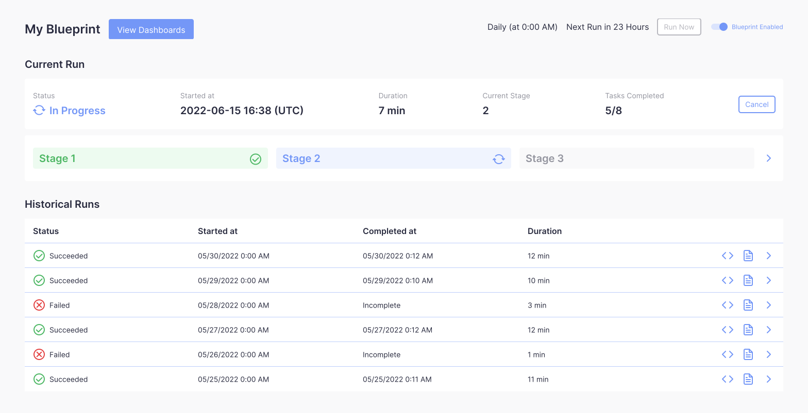
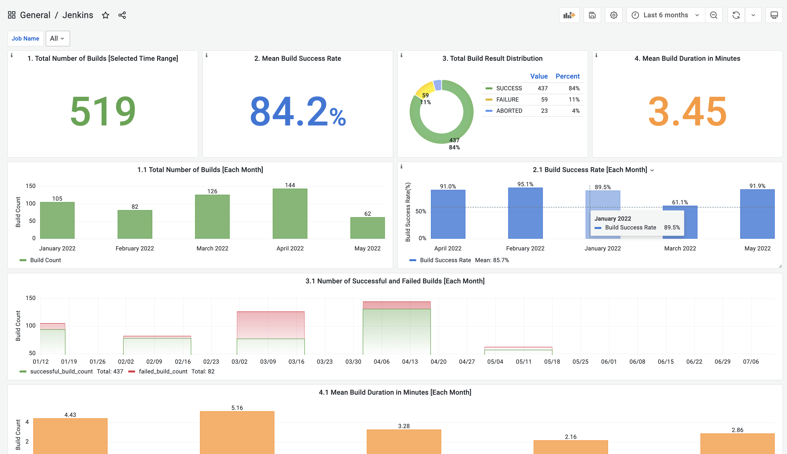
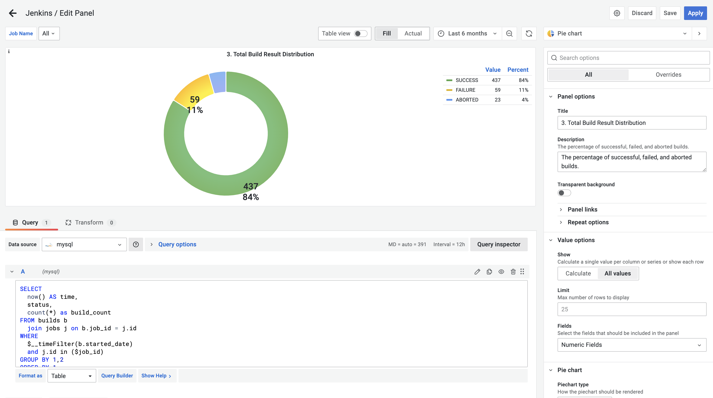

 

 

# Apache DevLake(Incubating)

 

## 🤔 What is Apache DevLake?

[Apache DevLake](https://devlake.apache.org) is an open-source dev data platform that ingests, analyzes, and visualizes the fragmented data from DevOps tools to distill insights for engineering productivity.

Apache DevLake is designed for developer teams looking to make better sense of their development process and to bring a more data-driven approach to their own practices. You can ask Apache DevLake many questions regarding your development process. Just connect and query.

## 🎯 What can be accomplished with Apache DevLake?

1. Collect DevOps data across the entire Software Development Life Cycle (SDLC) and connect the siloed data with a standard [data model](https://devlake.apache.org/docs/DataModels/DevLakeDomainLayerSchema).
2. Visualize out-of-the-box engineering [metrics](https://devlake.apache.org/docs/EngineeringMetrics) in a series of use-case driven dashboards.
3. Easily extend DevLake to support your data sources, metrics, and dashboards with a flexible [framework](https://devlake.apache.org/docs/Overview/Architecture) for data collection and ETL.

## 🤓 How do I use DevLake?
### 1. Set up DevLake
You can set up Apache DevLake by following our step-by step instruction for [Install via Docker Compose](https://devlake.apache.org/docs/QuickStart/DockerComposeSetup) or [Install via Kubernetes](https://devlake.apache.org/docs/QuickStart/KubernetesSetup). Please ask community if you get stuck at any point. 

### 2. Create a Blueprint
The DevLake Configuration UI will guide you through the process (a Blueprint) to define the data connections, data scope, transformation and sync frequency of the data you wish to collect.

### 3. Track the Blueprint's progress
You can track the progress of the Blueprint you have just set up.

### 4. View the pre-built dashboards
Once the first run of the Blueprint is completed, you can view the corresponding dashboards.

### 5. Customize the dahsboards with SQL
If the pre-built dashboards are limited for your use cases, you can always customize or create your own metrics or dashboards with SQL.

## 💪 Supported Data Sources

| Data Source                                                | Domain                                                     | Versions                             |
| ---------------------------------------------------------- | ---------------------------------------------------------- | ------------------------------------ |
| [Feishu](https://devlake.apache.org/docs/Plugins/feishu)   | Documentation                                              | Cloud                                |
| [GitHub](https://devlake.apache.org/docs/Plugins/github)   | Source Code Management, Code Review, Issue/Task Management | Cloud                                |
| [Gitlab](https://devlake.apache.org/docs/Plugins/gitlab)   | Source Code Management, Code Review, Issue/Task Management | Cloud, Community Edition 13.x+       |
| [Jenkins](https://devlake.apache.org/docs/Plugins/jenkins) | CI/CD                                                      | 2.263.x+                             |
| [Jira](https://devlake.apache.org/docs/Plugins/jira)       | Issue/Task Management                                      | Cloud, Server 8.x+, Data Center 8.x+ |
| TAPD                                                       | Issue/Task Management                                      | Cloud                                |

## 🚀 Quick Start
- [Install via Docker Compose](https://devlake.apache.org/docs/QuickStart/DockerComposeSetup)
- [Install via Kubernetes](https://devlake.apache.org/docs/QuickStart/KubernetesSetup)
- [Install in Temporal Mode](https://devlake.apache.org/docs/UserManuals/TemporalSetup)
- [Install in Developer Mode](https://devlake.apache.org/docs/DeveloperManuals/DeveloperSetup)

## ⌚ Project Roadmap
- <a href="https://devlake.apache.org/docs/Overview/Roadmap" target="_blank">Roadmap 2022</a>: Detailed project roadmaps for 2022.

## 😍 How to Contribute
This section lists all the documents to help you contribute to the repo.

- [Architecture](https://devlake.apache.org/docs/Overview/Architecture): Architecture of Apache DevLake
- [Data Model](https://devlake.apache.org/docs/DataModels/DevLakeDomainLayerSchema): Domain Layer Schema
- [Add a Plugin](/plugins/README.md): Guide to add a plugin
- [Add Metrics](/plugins/HOW-TO-ADD-METRICS.md): Guide to add metrics in a plugin
- [Contribution Guidelines](https://devlake.apache.org/community): Start from here if you want to make contribution

## 💙 Community

- <a href="https://join.slack.com/t/devlake-io/shared_invite/zt-18uayb6ut-cHOjiYcBwERQ8VVPZ9cQQw" target="_blank">Slack</a>: Message us on Slack
- <a href="https://github.com/apache/incubator-devlake/wiki/FAQ" target="_blank">FAQ</a>: Frequently Asked Questions
- Wechat Community: 
  

## 📄 License

This project is licensed under Apache License 2.0 - see the [LICENSE](LICENSE) file for details.
