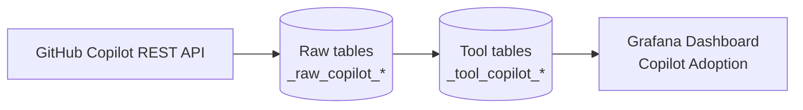

# Copilot Plugin (Adoption Metrics)

This plugin ingests GitHub Copilot **organization-level adoption metrics** (daily usage and seat assignments) and provides a Grafana dashboard for adoption trends.

It follows the same structure/patterns as other DevLake data-source plugins (notably `backend/plugins/q_dev`).

## What it collects

**Phase 1 endpoints** (GitHub Copilot REST API):

- `GET /orgs/{org}/copilot/billing`
- `GET /orgs/{org}/copilot/billing/seats`
- `GET /orgs/{org}/copilot/metrics`

**Stored data (tool layer)**:

- `_tool_copilot_org_metrics` (daily aggregates)
- `_tool_copilot_language_metrics` (editor/language breakdown)
- `_tool_copilot_seats` (seat assignments)

## Data flow (high level)



## Repository layout

- `api/` – REST layer for connections/scopes
- `impl/` – plugin meta, options, connection helpers
- `models/` – tool-layer models + migrations
- `tasks/` – collectors/extractors and pipeline registration
- `e2e/` – E2E fixtures and golden CSV assertions
- `docs/` – documentation assets

## Setup

### Prerequisites

- GitHub Copilot Business or Enterprise enabled for the target organization
- A token that can access Copilot billing/metrics (classic PAT with `manage_billing:copilot` works)

### 1) Create a connection

1. DevLake UI → **Data Integrations → Add Connection → GitHub Copilot**
2. Fill in:
	 - **Name**: e.g. `Copilot Octodemo`
	 - **Endpoint**: defaults to `https://api.github.com`
	 - **Organization**: GitHub org slug
	 - **Token**: PAT with required scope
3. Click **Test Connection** (calls `GET /orgs/{org}/copilot/billing`).
4. Save the connection.

### 2) Create a scope

Add an organization scope for that connection. For Phase 1, `implementationDate` is optional.

### 3) Create a blueprint (recipe)

Use a blueprint plan like:

```json
[
	[
		{
			"plugin": "copilot",
			"options": {
				"connectionId": 1,
				"scopeId": "octodemo"
			}
		}
	]
]
```

Run the blueprint daily to keep metrics up to date.

## Dashboard

The Grafana dashboard JSON is in `grafana/dashboards/copilot/adoption.json`.

Link: `grafana/dashboards/copilot/adoption.json`

## Error handling guidance

- **403 Forbidden** → token missing required billing/metrics scope, or org lacks Copilot access
- **404 Not Found** → incorrect org slug, or Copilot endpoints unavailable for the org
- **422 Unprocessable Entity** → Copilot metrics disabled in GitHub org settings
- **429 Too Many Requests** → respect `Retry-After`; collectors implement backoff/retry

Tokens are sanitized before persisting. When patching an existing connection, omit the token to retain the encrypted value already stored in DevLake.

## Limitations (Phase 1)

- Metrics endpoint is limited to a rolling **100-day** window (GitHub API constraint)
- GitHub enforces a privacy threshold (often **≥ 5 engaged users**) and may omit daily data
- Enterprise download endpoints and per-user metrics (JSONL exports) are intentionally deferred to Phase 2+

## More docs

- Spec quickstart: `specs/001-copilot-metrics-plugin/quickstart.md`
