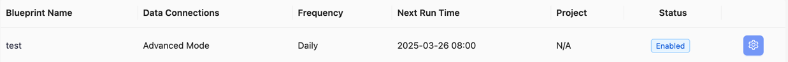

<!--
Licensed to the Apache Software Foundation (ASF) under one or more
contributor license agreements.  See the NOTICE file distributed with
this work for additional information regarding copyright ownership.
The ASF licenses this file to You under the Apache License, Version 2.0
(the "License"); you may not use this file except in compliance with
the License.  You may obtain a copy of the License at

    http://www.apache.org/licenses/LICENSE-2.0

Unless required by applicable law or agreed to in writing, software
distributed under the License is distributed on an "AS IS" BASIS,
WITHOUT WARRANTIES OR CONDITIONS OF ANY KIND, either express or implied.
See the License for the specific language governing permissions and
limitations under the License.
-->

# Q Developer Plugin

This plugin is used to retrieve AWS Q Developer usage data from AWS S3, process and analyze it, and resolve user display names through AWS IAM Identity Center.

## Features

- Retrieve CSV files from a specified prefix in AWS S3
- Parse user usage data from CSV files
- Resolve user UUIDs to human-readable display names via AWS IAM Identity Center
- Aggregate data by user and calculate various metrics

## Configuration

Configuration items include:

1. AWS Access Key ID
2. AWS Secret Key
3. AWS Region
4. S3 Bucket Name
5. Rate Limit (per hour)
6. IAM Identity Center Store ID
7. IAM Identity Center Region

You can create a connection using the following curl command:
```bash
curl 'http://localhost:8080/plugins/q_dev/connections' \
--header 'Content-Type: application/json' \
--data-raw '{
    "name": "q_dev_connection",
    "accessKeyId": "<YOUR_ACCESS_KEY_ID>",
    "secretAccessKey": "<YOUR_SECRET_ACCESS_KEY>",
    "region": "<AWS_REGION>",
    "bucket": "<YOUR_S3_BUCKET_NAME>",
    "identityStoreId": "<YOUR_IDENTITY_STORE_ID>",
    "identityStoreRegion": "<YOUR_IDENTITY_CENTER_REGION>",
    "rateLimitPerHour": 20000
}'
```
Please replace the following placeholders with actual values:
<YOUR_ACCESS_KEY_ID>: Your AWS access key ID
<YOUR_SECRET_ACCESS_KEY>: Your AWS secret access key
<YOUR_S3_BUCKET_NAME>: The S3 bucket name you want to use
<AWS_REGION>: The region where your S3 bucket is located
<YOUR_IDENTITY_STORE_ID>: Your IAM Identity Center Store ID (format: d-xxxxxxxxxx)
<YOUR_IDENTITY_CENTER_REGION>: The region where your Identity Center is deployed

You can get all connections using the following curl command:
```bash
curl Get 'http://localhost:8080/plugins/q_dev/connections'
```

## Data Flow

The plugin includes the following tasks:

1. `collectQDevS3Files`: Collects file metadata information from S3, without downloading file content
2. `extractQDevS3Data`: Uses S3 file metadata to download CSV data, parse it into the database, and resolve user display names via Identity Center
3. `convertQDevUserMetrics`: Converts user data into aggregated metrics, calculating averages and totals

## Data Tables

- `_tool_q_dev_connections`: Stores AWS S3 connection information
- `_tool_q_dev_s3_file_meta`: Stores S3 file metadata
- `_tool_q_dev_user_data`: Stores user data parsed from CSV files
- `_tool_q_dev_user_metrics`: Stores aggregated user metrics

Note: `_tool_q_dev_user_data` and `_tool_q_dev_user_metrics` tables now include `display_name` fields for human-readable user identification.

## Data Collection Configuration
Steps to collect data:
1. On the Config UI page, select `Advanced Mode` on the left, click `Blueprints`
2. Create a new Blueprint
3.  Click the gear icon on the right
4. Paste the following JSON configuration into `JSON Configuration`:

```json
[
  [
    {
      "plugin": "q_dev",
      "subtasks": null,
      "options": {
        "connectionId": 5,
        "s3Prefix": ""
      }
    }
  ]
]
```