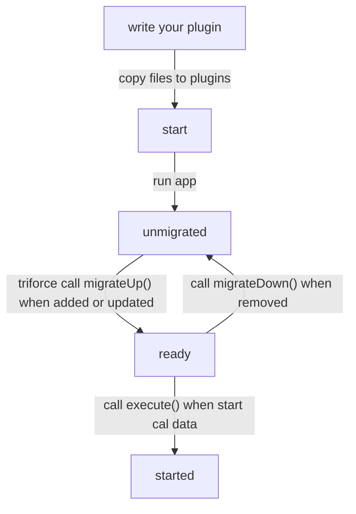
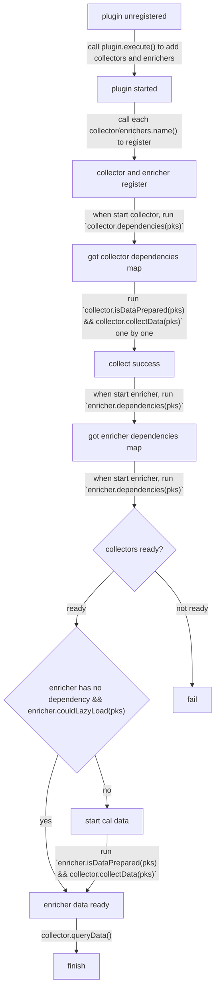

# How plugin work?

## plugin state and callback flow

## collector and enricher flow

## picture generate by mermaid

view on github: `https://github.com/BackMarket/github-mermaid-extension`

or view online: `https://mermaid-js.github.io/mermaid-live-editor`
