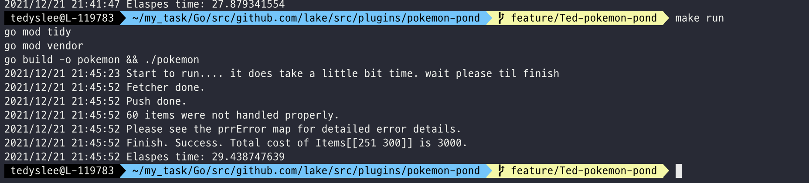

## This is Ted's assignment

## How to run or usage
1. Execute the dockerfile located in the root folder, not this source folder. ex, docker-compose up -d  
2. Execute the following command in the source folder.  (see below image)
    > make run

3. If an error such as DB-related error or http error occurs during execution, it is stored in a separate map to handle the error later.  
    There are 60 errors. As a result of investigating all 60 errors, all 404 not found occurs when calling with the actual itemid.  
    See below image. 
    ex,  https://pokeapi.co/api/v2/item/876  

   

## How to develop
1. Using PostgreDB
2. Gorm package for posrgre
3. Data was fetched using the producer/consumer pattern using channels and stored in the DB.
4. Errors that occur are saved as a map, and after all work is completed, you can process the desired error again with the error. ex) retry, alert ...
5. As it is an interview assignment, I did not use config or os.Getenv() in particular.
6. If I spend a little more time, you can improve the performance even more.

## TODO
1. It is better to conduct more tests.
2. It can be extended with cli.
3. DB work seems to be able to improve performance even more by using Batch.

