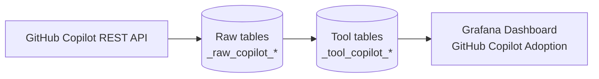

# Quickstart — GitHub Copilot Adoption Plugin

Date: December 11, 2025  
Branch: `001-copilot-metrics-plugin`

## 1. Prerequisites
- DevLake server running from `docker-compose-dev.yml` with MySQL/PostgreSQL and Grafana.
- GitHub Copilot Business or Enterprise subscription enabled for the target organization.
- Personal Access Token (classic) with `manage_billing:copilot` scope (or org-level Copilot Business fine-grained token).
- DevLake CLI/Config UI access to create plugin connections.

## 2. Data Flow (What Happens)



## 3. Install Plugin (after implementation)
1. Pull latest DevLake code with the GitHub Copilot plugin branch.
2. Run `make dep` (installs Go + UI dependencies if needed).
3. Rebuild the server: `make build` or `make dev`.
4. Sync Grafana dashboards: `make grafana-dashboard-sync` (or deploy JSON manually).

## 4. Configure GitHub Copilot Connection
1. Navigate to **Data Integrations → Add Connection → GitHub Copilot** (new entry).
2. Provide:
  - **Name**: e.g., `GitHub Copilot Octodemo`
   - **Endpoint**: default `https://api.github.com`
   - **Organization**: GitHub org slug (e.g., `octodemo`)
  - **Token**: PAT with GitHub Copilot billing scope
3. Click **Test Connection** and ensure the response shows plan type, active seats, and success status.
4. Save the connection.

## 5. Define Scope
1. In the newly created connection, open **Scopes**.
2. Add the organization scope (same slug). Leave `implementationDate` blank for Phase 1 (Phase 2 will use it).
3. Save scopes; blueprint JSON will reference `scopeId = <orgSlug>`.

## 6. Create Blueprint
```json
[
  [
    {
      "plugin": "copilot",
      "options": {
        "connectionId": 1,
        "scopeId": "octodemo"
      }
    }
  ]
]
```
- Schedule the blueprint to run daily to stay within the 100-day lookback.

## 7. Run Collection
- Run the blueprint immediately (`Run Now`).
- Monitor DevLake logs for rate-limit warnings or privacy-threshold messages.
- Verify that tables `_tool_copilot_org_metrics` and `_tool_copilot_seats` contain new records.

## 8. Explore Grafana Adoption Dashboard
1. Open Grafana → `GitHub Copilot Adoption` dashboard.
2. Select your GitHub Copilot dataset via dashboard variables:
  - `connection_id`: your GitHub Copilot connection ID
   - `scope_id`: the organization scope ID (typically the org slug)
3. Panels available:
   - Active vs Engaged users over time
   - Acceptance rate (acceptances / suggestions)
  - GitHub Copilot IDE vs GitHub.com chat usage
   - Seat timeline (total vs active)
4. Adjust time range (e.g., last 90 days) and verify panels refresh successfully.

## 9. Verify Data (Quick Checks)

- Confirm daily org metrics exist for your scope in `_tool_copilot_org_metrics`
- Confirm seat rows exist for your org in `_tool_copilot_seats`
- For language/editor panels, confirm `_tool_copilot_language_metrics` has rows after at least one metrics run

## 10. Troubleshooting
- **403 Forbidden**: Ensure PAT includes `manage_billing:copilot`.
- **422 Metrics Disabled**: Copilot Metrics API must be enabled in GitHub organization settings.
- **Empty datasets**: Organization may not meet the ≥5 engaged user privacy threshold; plugin will log warnings.
- **Rate limit**: Respect Retry-After headers; rerun pipeline if necessary.

## 11. Next Steps (Phase 2 Preview)
- Configure `implementationDate` once Phase 2 is available to unlock Impact Dashboard comparisons.
- Evaluate team-level metrics demand before opting into Phase 2 feature branch.
